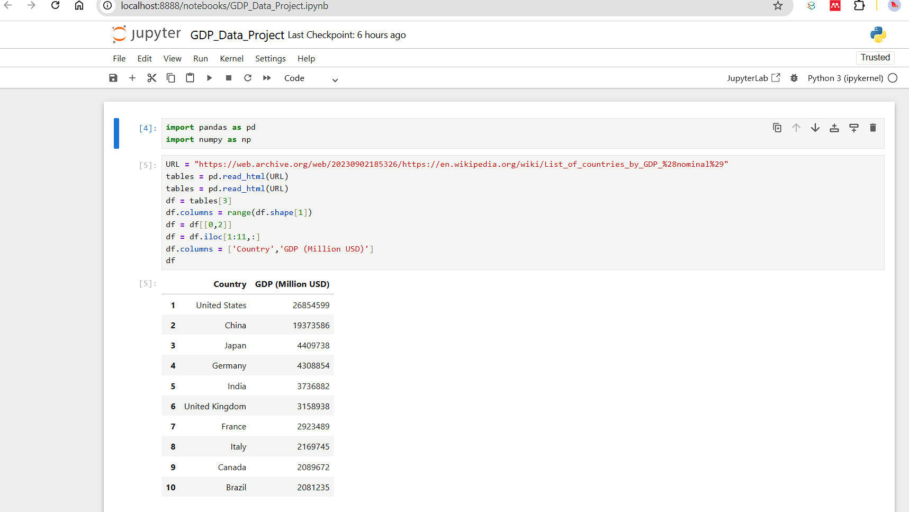
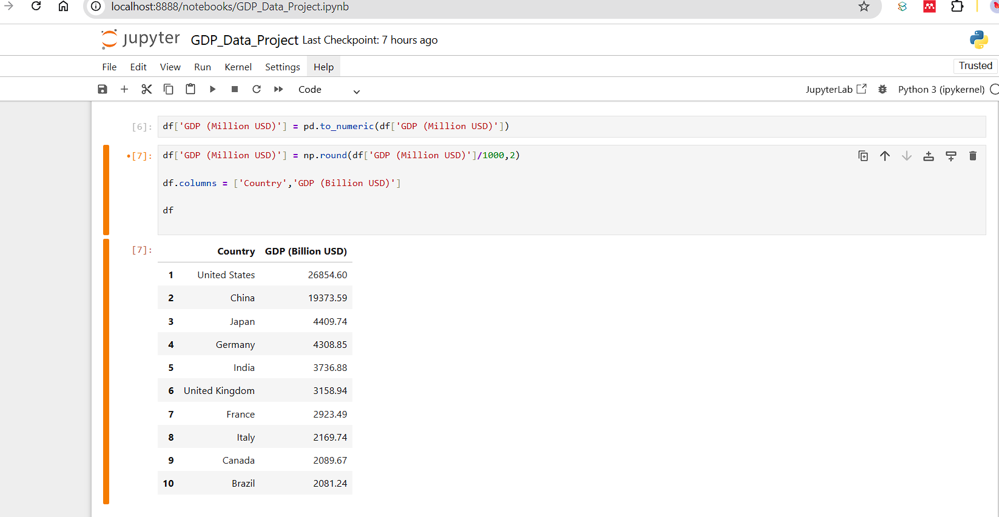

# GDP Data Extraction and Processing Project

## Project Title

GDP Data Extraction and Processing Using Python

---

# Project Overview

This project demonstrates a practical data engineering and data analytics workflow using Python. The objective of the project is to extract GDP data for the top economies in the world from a web source, clean and transform the data, convert GDP values from Million USD to Billion USD, and export the processed data into a CSV file.



The project uses:

* Python
* Pandas
* NumPy
* Jupyter Notebook
* Web table extraction using Pandas

---

# Business Scenario

An international company planning global expansion requires insights into the largest economies in the world based on GDP. As a junior data engineer/data analyst, the task is to extract, process, and prepare GDP data for reporting and decision-making.

---

# Skills Demonstrated

This project demonstrates the following technical and analytical skills:

* Web data extraction
* HTML table extraction
* Data cleaning and preprocessing
* Data transformation
* Data type conversion
* DataFrame manipulation
* CSV file export
* Jupyter Notebook workflow
* Debugging and problem solving

---

# Tools and Technologies Used

| Tool             | Purpose                             |
| ---------------- | ----------------------------------- |
| Python           | Programming language                |
| Pandas           | Data extraction and manipulation    |
| NumPy            | Numerical operations and rounding   |
| Jupyter Notebook | Interactive development environment |
| CSV              | Data export format                  |

---

# Project Workflow

## Step 1 — Import Libraries

```python
import pandas as pd
import numpy as np
```

---

## Step 2 — Define Data Source URL

```python
URL = "https://web.archive.org/web/20230902185326/https://en.wikipedia.org/wiki/List_of_countries_by_GDP_%28nominal%29"
```

---

## Step 3 — Extract Tables from Website

```python
tables = pd.read_html(URL)
```

---

## Step 4 — Select Required Table

```python
df = tables[3]
```

---

## Step 5 — Simplify Column Headers

```python
df.columns = range(df.shape[1])
```

---

## Step 6 — Retain Required Columns

```python
df = df[[0,2]]
```

---

## Step 7 — Retain Top 10 Economies

```python
df = df.iloc[1:11,:]
```

---

## Step 8 — Rename Columns

```python
df.columns = ['Country','GDP (Million USD)']
```

---

## Step 9 — Convert GDP from Million USD to Billion USD

```python
df['GDP (Million USD)'] = df['GDP (Million USD)'].astype(int)

df[['GDP (Million USD)']] = df[['GDP (Million USD)']] / 1000

df[['GDP (Million USD)']] = np.round(df[['GDP (Million USD)']], 2)
```

---

## Step 10 — Rename GDP Column

```python
df = df.rename(columns = {'GDP (Million USD)' : 'GDP (Billion USD)'})
```

---

## Step 11 — Export Data to CSV

```python
df.to_csv("Largest_economies.csv", index=False)
```

---

# Final Output



The final output contains:

* Top 10 economies by GDP
* GDP values converted to Billion USD
* Clean structured dataset exported to CSV

Example output:

| Country       | GDP (Billion USD) |
| ------------- | ----------------- |
| United States | 26854.60          |
| China         | 19373.59          |
| Japan         | 4409.74           |
| Germany       | 4308.85           |
| India         | 3736.88           |

---

# Challenges Encountered

During the project, several practical issues were encountered and resolved:

* Incorrect table index extraction
* Multi-level HTML table headers
* Data type conversion errors
* Jupyter Notebook kernel disconnections
* CSV export verification

These issues provided valuable hands-on debugging and data-cleaning experience.

---

# Key Learning Outcomes

Through this project, the following concepts were learned and practiced:

* Extracting structured data from websites
* Working with HTML tables in Pandas
* Cleaning messy real-world datasets
* Converting data types for numerical analysis
* Applying NumPy functions for rounding operations
* Exporting processed datasets for further analysis
* Using Jupyter Notebook for data analytics workflows

---

# Folder Structure

```text
GDP_Project/
│
├── GDP_Data_Project.ipynb
├── Largest_economies.csv
└── README.md
```

---

# Future Improvements

Potential future enhancements for this project include:

* Automating updates using APIs
* Adding data visualization dashboards
* Creating interactive charts
* Comparing GDP growth over time
* Integrating with business intelligence tools

---

# About Me

I am an aspiring AI-driven business/data analyst with a background in marketing, customer experience, and business analytics. I am building practical skills in Python, data analytics, business intelligence, and AI-assisted decision-making.

---

# Author

Richard Adutwum

---

# License

This project is for educational and portfolio purposes.
